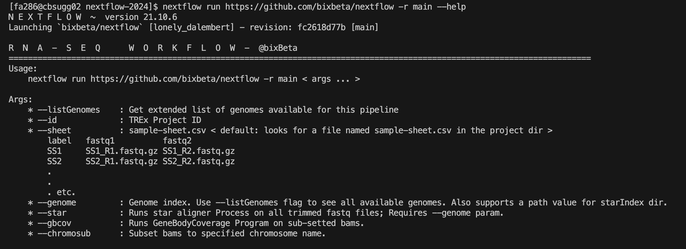

# Nextflow Pipeline for RNA-seq runs on GG02 

<hr>

This pipeline can be directly used on GG02. To envoke the pipeline please make sure you have nextflow available in your path. 
You may use the [ following guide](https://biohpc.cornell.edu/lab/userguide.aspx?a=software&i=638#c>) to help you configure nextflow for your account. 


To see if this pipeline works on your account simply run the following command on your terminal:

```
nextflow run https://github.com/bixbeta/nextflow -r main --help
```

If successful, you may see the following output on your terminal console:



