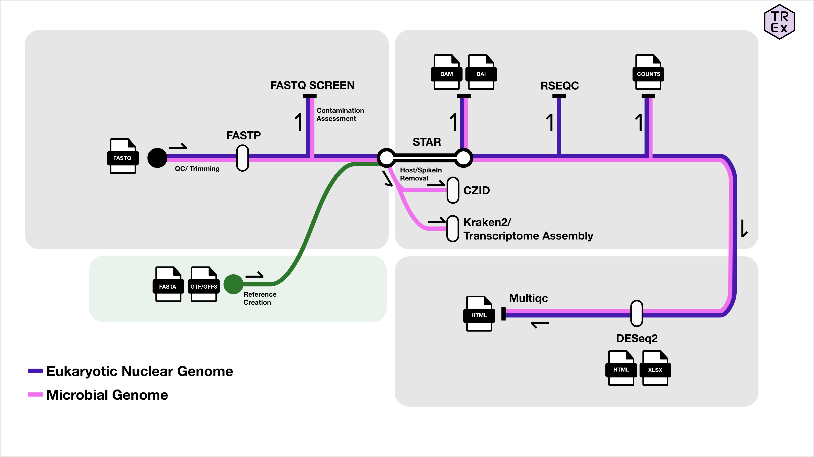

# Nextflow Pipeline for RNA-seq runs on GG02 
[](https://trex.biotech.cornell.edu/)

[](https://github.com/bixBeta/nextflow/actions/workflows/docker.yml)
[](https://hub.docker.com/r/bixbeta/trex-rna)
[](https://hub.docker.com/r/bixbeta/trex-rna/tags)
[](https://www.nextflow.io/)
[](https://sylabs.io/singularity/)
[](https://czid.org/)

<hr>

This pipeline can be directly used on GG02. To envoke the pipeline please make sure you have nextflow available in your path. 
You may use the [ following guide](https://biohpc.cornell.edu/lab/userguide.aspx?a=software&i=638#c>) to help you configure nextflow for your account. 


To see if this pipeline works on your account simply run the following command on your terminal:

```
nextflow run https://github.com/bixBeta/nextflow -r main --help
```

If successful, you may see the following output on your terminal console:

```
N E X T F L O W  ~  version 25.10.0
Pulling bixBeta/nextflow ...
 downloaded from https://github.com/bixBeta/nextflow.git
Launching `https://github.com/bixBeta/nextflow` [peaceful_nobel] DSL2 - revision: ... [main]

R  N  A  -  S  E  Q      W  O  R  K  F  L  O  W  -  @bixBeta
=======================================================================================================================================================================
Usage:
    nextflow run https://github.com/bixBeta/nextflow -r main < args ... >

Args:
    * --listGenomes    : Get extended list of genomes available for this pipeline
    * --id             : TREx Project ID
    * --sheet          : sample-sheet.csv < default: looks for a file named sample-sheet.csv in the project dir >
    ...
```


<hr>
It is always a good idea to run the pull command before executing the pipeline. This will ensure that the user is using the latest branch version of the pipeline.
Use the following command to ensure the usage of the latest version of the pipeline:

```
nextflow pull https://github.com/bixBeta/nextflow -r main 
```
<hr>
TREx Workflow:


