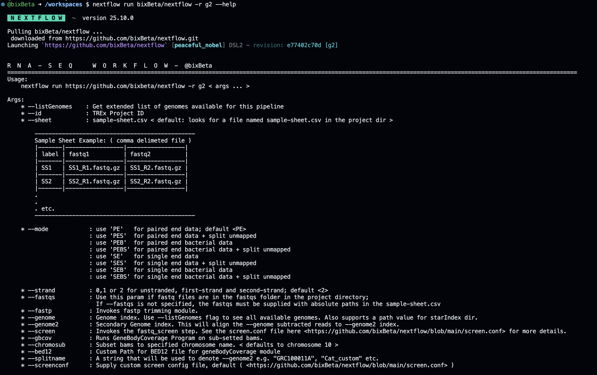

# Nextflow Pipeline for RNA-seq runs on CBSU BioHPC Servers 
[](https://trex.biotech.cornell.edu/)

[](https://github.com/bixBeta/nextflow/actions/workflows/docker.yml)
[](https://hub.docker.com/r/bixbeta/trex-rna)
[](https://hub.docker.com/r/bixbeta/trex-rna/tags)
[](https://www.nextflow.io/)
[](https://sylabs.io/singularity/)
[](https://czid.org/)

<hr>

This pipeline can be directly used on CBSU BioHPC Servers. To invoke the pipeline please make sure you have nextflow available in your path. 
You may use the [ following guide](https://biohpc.cornell.edu/lab/userguide.aspx?a=software&i=638#c>) to help you configure nextflow for your account. 


To see if this pipeline works on your account simply run the following command on your terminal:

```
nextflow run bixBeta/nextflow -r main --help
```

If successful, you may see the following output on your terminal console:




<hr>
It is always a good idea to run the pull command before executing the pipeline. This will ensure that the user is using the latest branch version of the pipeline.
Use the following command to ensure the usage of the latest version of the pipeline:

```
nextflow pull bixBeta/nextflow -r main
```
<hr>

## Generate a Sample Sheet

Use `mk-sheet.py` to auto-generate a `sample-sheet.csv` from your Illumina delivery directory.
Labels are derived from `Sample_*` folder names — everything before the order number is kept (e.g. `Sample_8027D_BH10_10_104***_...` → `8027D_BH10_10`).

Download the script:

```bash
wget https://raw.githubusercontent.com/bixBeta/nextflow/main/mk-sheet.py
```

**Paired-end — absolute paths** (default):
```bash
python mk-sheet.py /local/Illumina/DRV/260***_RX_0***/Unaligned/Project_104***
```

**Paired-end — filenames only** (use alongside `--fastqs`, FASTQs must be in a `fastqs/` folder):
```bash
python mk-sheet.py /local/Illumina/DRV/.../Project_104*** --names
```

**Single-end:**
```bash
python mk-sheet.py /local/Illumina/DRV/.../Project_104*** --se
```

**Custom output filename:**
```bash
python mk-sheet.py /local/Illumina/DRV/.../Project_104*** -o my-sheet.csv
```

<hr>

## Parameters File (alternative approach)

Download the annotated `params.yaml` template to your working directory and edit it before running:

```bash
wget https://raw.githubusercontent.com/bixBeta/nextflow/main/params.yaml
```

Then run the pipeline using the params file instead of command-line flags:

```bash
nextflow run bixBeta/nextflow -r main -params-file params.yaml
```

> All parameters are documented with descriptions and defaults inside the file. Uncomment optional sections as needed.

<hr>
TREx Workflow:


